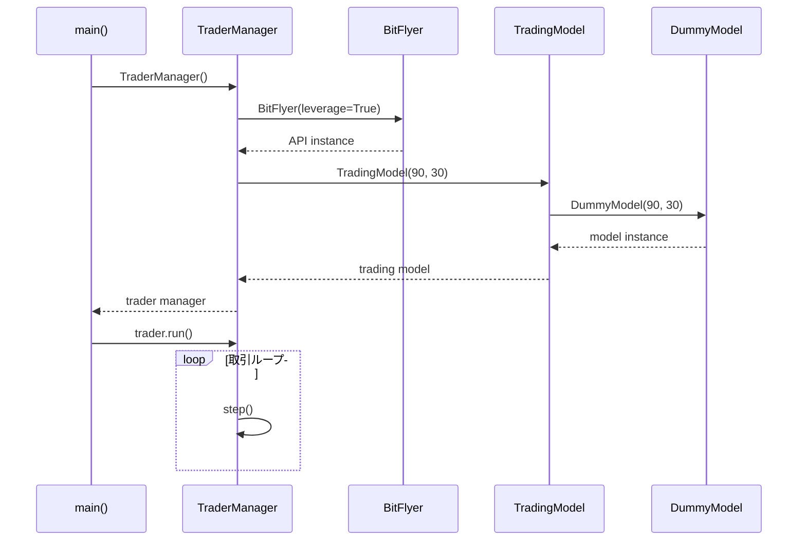
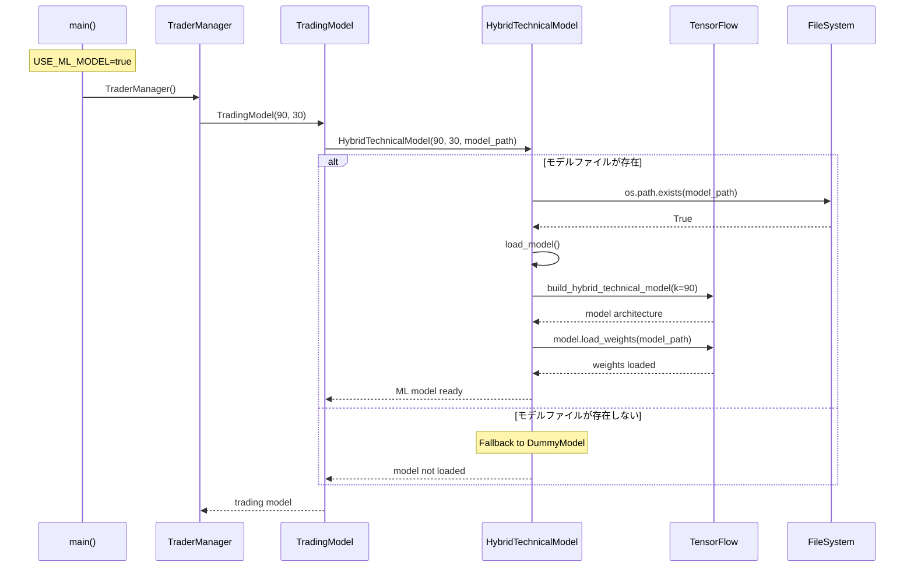
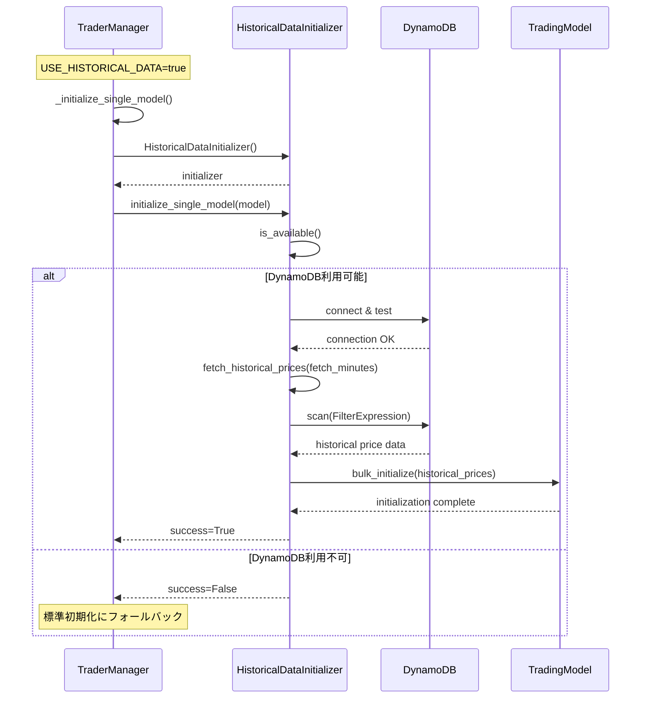
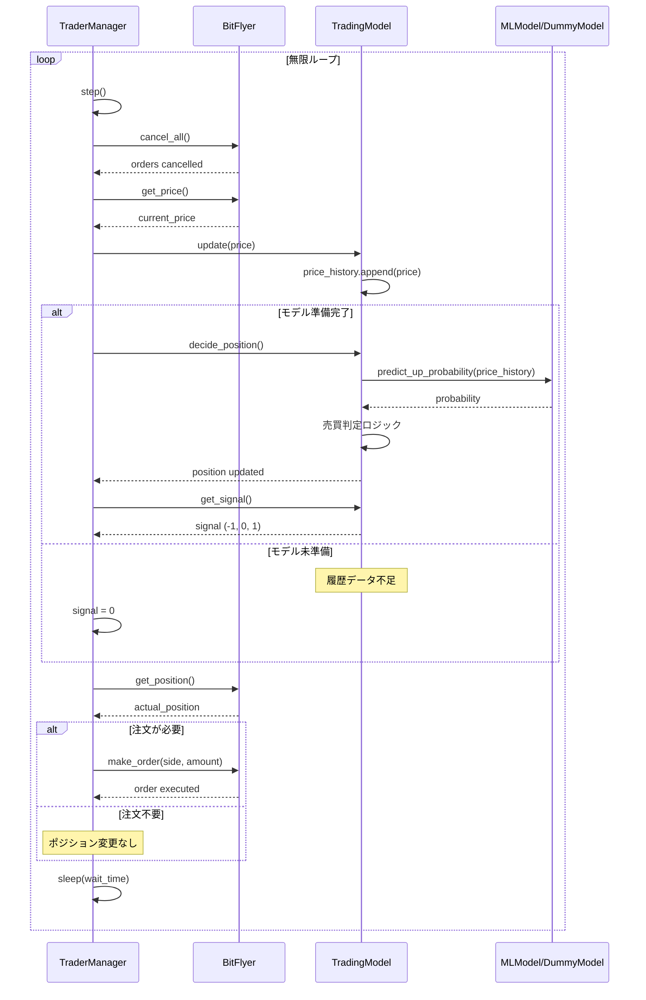
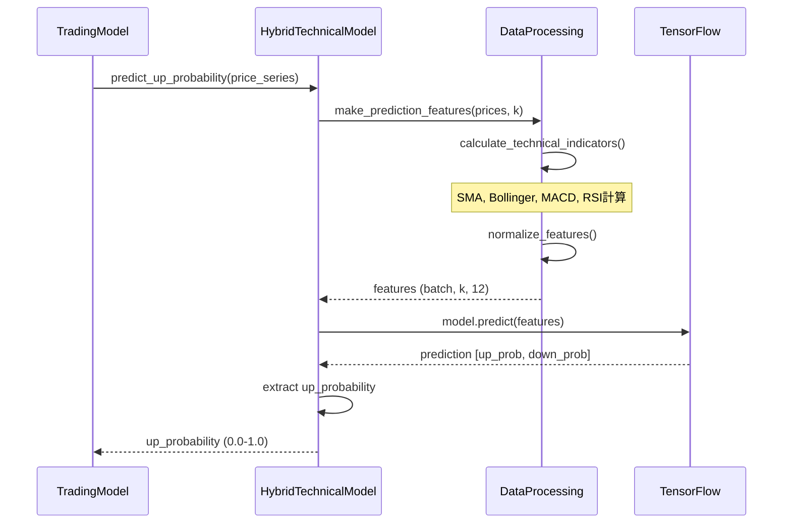
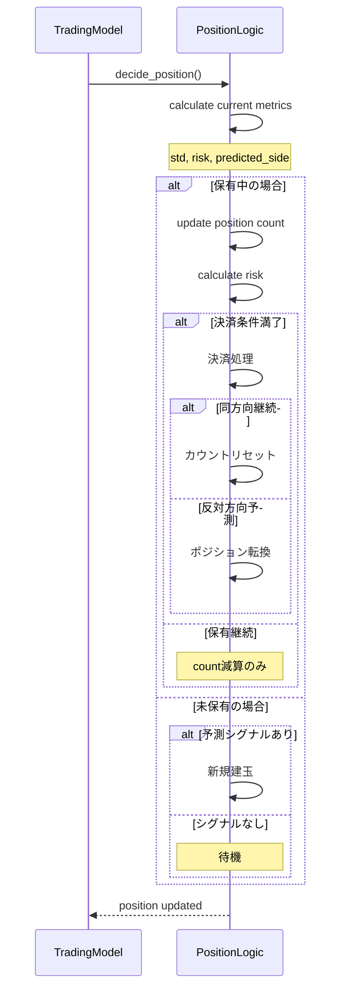
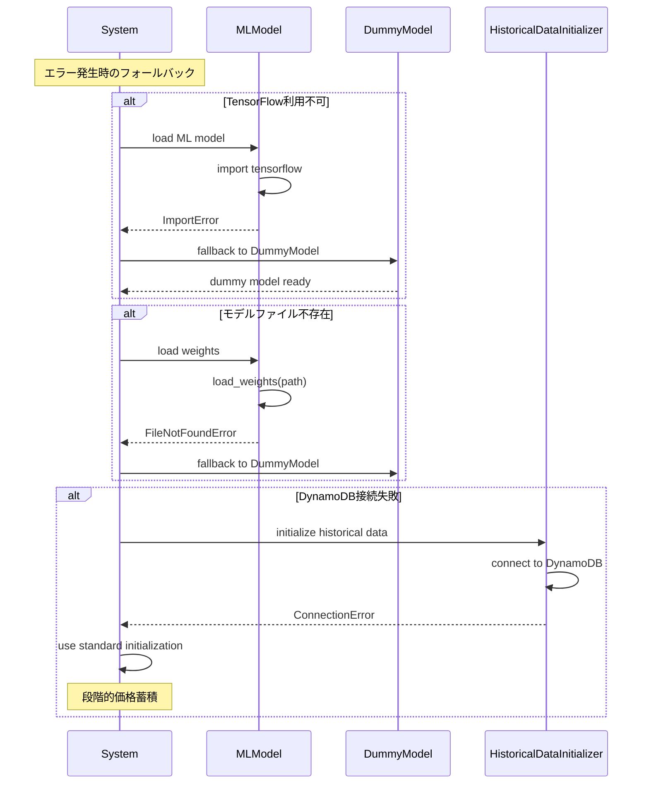

# 取引ボット処理シーケンス図

VSCodeでMermaid図を表示するには：
1. `Mermaid Preview` 拡張機能をインストール
2. このファイルを開いてコマンドパレット（Ctrl+Shift+P）から `Mermaid: Preview` を実行

## 1. 基本初期化シーケンス（ダミーモデル）

## 2. ML統合初期化シーケンス

## 3. 履歴データ初期化シーケンス

## 4. メイン取引ループシーケンス

## 5. ML予測詳細シーケンス

## 6. ポジション管理シーケンス

## 7. エラーハンドリング・フォールバックシーケンス

